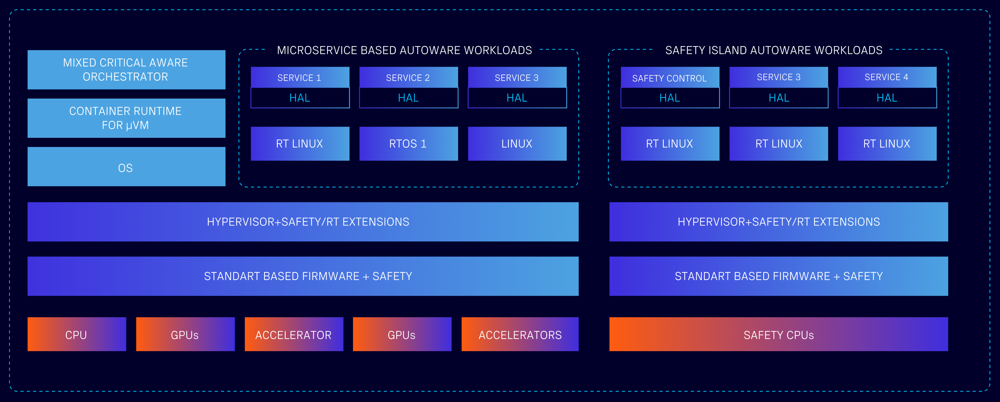
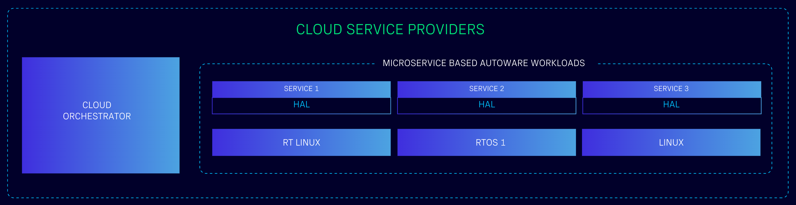
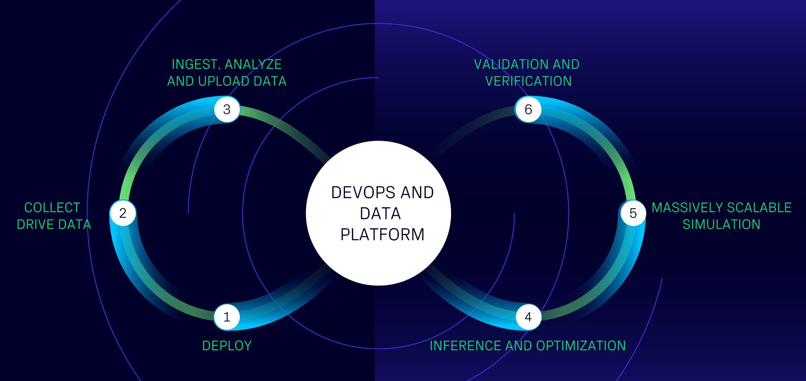

# Open AD Kit

#### Containerized Components for Autoware

Open AD Kit is a collaborative project developed by the Autoware Foundation and its member companies and alliance partners. It aims to bring software-defined best practices to the Autoware project and to enhance the Autoware ecosystem and capabilities by partnering with other organizations that share the goal of creating software-defined vehicles.

Open AD Kit aims to democratize autonomous drive (AD) systems by bringing the cloud and edge closer together. In doing so, Open AD Kit will lower the threshold for developing and deploying the Autoware software stack by providing an efficient and modernized CI-CD approach.

#### The First SOAFEE Blueprint

The Autoware Foundation is a voting member of the [SOAFEE (Scalable Open Architecture For the Embedded Edge)](https://soafee.io/) initiative, as the Autoware Open AD Kit is the first SOAFEE blueprint for the software defined vehicle ecosystem.

### Quick Links

- **[Getting Started](https://autowarefoundation.github.io/openadkit/getting-started/)**
- **[Documentation](https://autowarefoundation.github.io/openadkit/)**
- **[Contributing](https://autowarefoundation.github.io/openadkit/contributing/)**

## Container Image Tags

Open AD Kit publishes build-specific, release, and latest-stable image tags to GitHub Container Registry.

- Stable release tags are immutable and use `<target>-<ros_distro>-vX.Y.Z`, for example `ghcr.io/autowarefoundation/openadkit:planning-control-humble-v1.0.0`.
- Latest stable aliases use `<target>-<ros_distro>` and `<target>-<ros_distro>-latest`, for example `ghcr.io/autowarefoundation/openadkit:planning-control-humble` and `ghcr.io/autowarefoundation/openadkit:planning-control-humble-latest`.
- Default ROS distro aliases use `<target>` and `<target>-latest`, for example `ghcr.io/autowarefoundation/openadkit:planning-control` and `ghcr.io/autowarefoundation/openadkit:planning-control-latest`. The current default ROS distro is Humble.
- Immutable build tags use `<target>-<ros_distro>-<build_tag>`, for example `ghcr.io/autowarefoundation/openadkit:planning-control-humble-123456789-1`.
- Pre-release tags use `<target>-<ros_distro>-vX.Y.Z-prerelease`, for example `ghcr.io/autowarefoundation/openadkit:planning-control-humble-v1.0.0-rc.1`; pre-releases do not update latest aliases.

Use stable release tags for fully pinned deployments. Sample compose files use default ROS distro aliases for convenience. CUDA image aliases are amd64-only.

## Key Features

### Modular Components

Open AD Kit is a micro-service based project, which means that it is designed to be deployed on a variety of platforms with microservices architecture. Each component is designed to be independent and can be deployed on a variety of platforms.

- **Independent components** for sensing, perception, mapping, localization, planning, control, and visualization
- **Multi-platform deployment** supporting both amd64 and arm64 architectures  
- **Service mesh integration** with configurable environment variables

### Mixed Criticality

Open AD Kit supports mixed criticality deployment, enabling separation of safety-critical and non-critical components. This architecture allows flexible deployment strategies where critical autonomous driving functions can run on certified hardware while monitoring and development components operate on standard platforms.

- **Flexible deployment** separating safety-critical and monitoring components
- **Configurable criticality** from development testing to production safety systems
- **Hardware abstraction** supporting safety island compute architectures

### Cloud Native

Open AD Kit leverages modern cloud native technologies to deliver scalable, portable AD stack.

- **Seamless scaling** from development laptops to production edge devices
- **Hybrid cloud support** bridging development and production environments
- **Container orchestration** ready for Kubernetes and similar platforms

### Connected and Continuous

Open AD Kit envisions an always connected, complete autonomous driving development and deployment platform spanning data collection, calibration, and map annotation to machine learning operations, open-source simulation and system validation.

- **Automated CI/CD** with GitHub Actions integration
- **Optimized build caching** for faster deployment cycles
- **Continuous testing** in containerized environments

