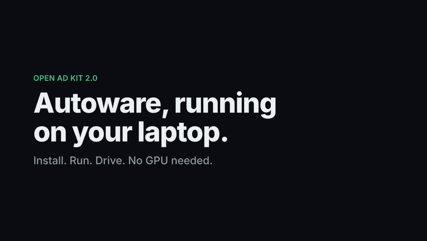

<h1 align="center">Open AD Kit</h1>

<p align="center">
  <b>The deployment layer for the Autoware ecosystem.</b><br>
  Autoware as container images and ready-to-run deployments, with one CLI on top.
</p>

<p align="center">
  <a href="https://github.com/autowarefoundation/openadkit/releases"></a>
  <a href="https://github.com/autowarefoundation/openadkit/actions/workflows/build-all-images.yaml"></a>
  <a href="https://autowarefoundation.github.io/openadkit/platforms/"></a>
  <a href="LICENSE"></a>
</p>

<p align="center">
  
</p>

[Autoware](https://github.com/autowarefoundation/autoware) provides the autonomy stack; Open AD Kit makes it deployable. It packages the stack into focused container images and ready-to-run deployments, with [Autoware Safety Island](https://autowarefoundation.github.io/autoware-safety-island/) alongside. One CLI runs them the same way on every host.

## Quickstart

On Ubuntu 22.04 or 24.04. No GPU needed.

```bash
# Install the CLI and put it on PATH
curl -fsSL https://github.com/autowarefoundation/openadkit/releases/latest/download/openadkit \
  | bash -s -- install
export PATH="$HOME/.local/bin:$PATH"

# Prepare the host, then start a shell in the docker group it adds you to
openadkit setup
newgrp docker

# Start Autoware
openadkit run planning-simulation
```

Open the visualizer address that `run` prints (password: `openadkit`). In RViz, set an initial pose and a goal, then press **AUTO** in the OperationMode panel. `openadkit stop` ends it. The [full Quickstart](https://autowarefoundation.github.io/openadkit/getting-started/) has the details.

## How It Fits Together

<picture>
  <source media="(prefers-color-scheme: dark)" srcset="docs/assets/images/readme-hero-dark.svg">
  
</picture>

## Deployments

A deployment is a ready-to-run Autoware stack for one task. `openadkit list` prints them in your terminal.

| Deployment | What it runs | Needs |
|---|---|---|
| [`planning-simulation`](https://autowarefoundation.github.io/openadkit/deployments/planning-simulation/) | Plan and follow a route on a sample map | No GPU |
| [`scenario-simulation`](https://autowarefoundation.github.io/openadkit/deployments/scenario-simulation/) | Predefined traffic scenarios in Scenario Simulator | No GPU |
| [`logging-simulation`](https://autowarefoundation.github.io/openadkit/deployments/logging-simulation/) | Replay recorded sensor data, sensing to localization | No GPU |
| [`carla-simulation`](https://autowarefoundation.github.io/openadkit/deployments/carla-simulation/) | Closed-loop driving in the CARLA simulator | NVIDIA GPU, amd64, Humble |
| [`safety-island-simulation`](https://autowarefoundation.github.io/openadkit/deployments/safety-island-simulation/) | Planning Simulation controlled by the Safety Island | amd64 |

With `--gpu`, Planning Simulation plans with the Diffusion Planner (experimental) and Logging Simulation runs CenterPoint on CUDA. With `--role`, Scenario and CARLA Simulation [split across two hosts](https://autowarefoundation.github.io/openadkit/deployments/split-host/) (experimental).

## Create a Kit

A kit holds only your differences from a deployment: your ROS packages, config overrides and extra services. [Create a Kit](https://autowarefoundation.github.io/openadkit/kits/create-a-kit/) covers the layout and each extension point.

```bash
openadkit new my-kit        # on top of planning-simulation
cd my-kit
openadkit run --verify      # start, wait until ready, run the verify step
openadkit build             # after you add ROS packages to overlay_ws/src
openadkit restart           # the services pick up the build
```

## Documentation

- [**Overview**](https://autowarefoundation.github.io/openadkit/) — what Open AD Kit is and how it is put together
- [**CLI & Maintenance**](https://autowarefoundation.github.io/openadkit/getting-started/cli/) — every command, settings, upgrades and cleanup
- [**Troubleshooting**](https://autowarefoundation.github.io/openadkit/getting-started/troubleshooting/) — Docker, data, GPU, visualizer and network
- [**Components**](https://autowarefoundation.github.io/openadkit/deployments/components/) — the container images and what each one runs
- [**Platforms**](https://autowarefoundation.github.io/openadkit/platforms/) — support tiers, AutoSD and host requirements
- [**Releases**](https://autowarefoundation.github.io/openadkit/releases/) — what a release ships, promises and proves
- [**Build from Source**](https://autowarefoundation.github.io/openadkit/development/build-from-source/) — build the images yourself

## Community

- **Working Group** — Thursdays at 13:00 UTC, open to everyone: [calendar](https://www.google.com/calendar/event?eid=YnY4dmJxZTVsM2h2cWE1cTJ2NmhtOWdwMzZfMjAyNjA5MjRUMTMwMDAwWiBhdXRvd2FyZS5vcmdfNmxvbDBobzVmdDAyMTdoOGM2MHBpMWZtMzBAZw) · [agendas](https://github.com/orgs/autowarefoundation/discussions?discussions_q=label%3Ameeting%3Aopenadkit-wg)
- **Chat** — questions and design discussions on the [Autoware Discord](https://discord.gg/Q94UsPvReQ)
- **Contribute** — [CONTRIBUTING.md](CONTRIBUTING.md) has the development workflow and validation steps

## License

Apache License 2.0. See [LICENSE](LICENSE).
