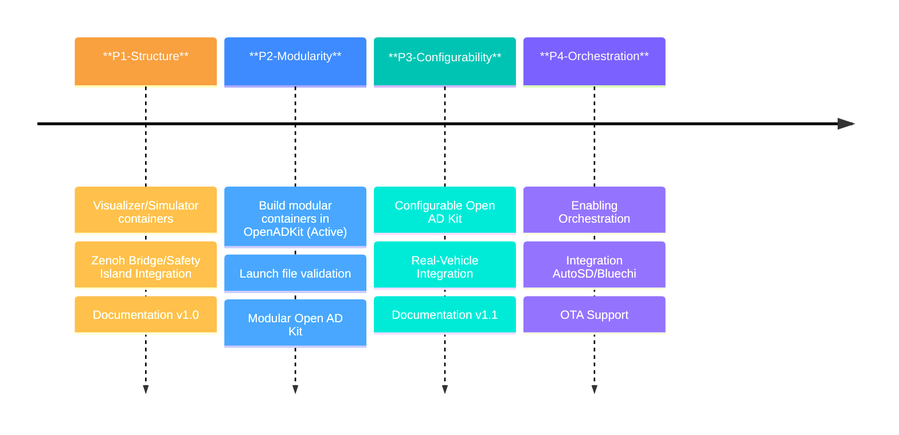

# Roadmap

```mermaid
---
config:
  themeVariables:
    cScaleLabel0: '#FFFFFF'
    cScale0: '#f9a03f'
    cScaleLabel1: '#FFFFFF'
    cScale1: '#3d8bff'
    cScaleLabel2: '#FFFFFF'
    cScale2: '#00c4b3'
    cScaleLabel3: '#FFFFFF'
    cScale3: '#7b61ff'
---

timeline
    **P1-Structure**
      : Visualizer/Simulator containers
      : Zenoh Bridge/Safety Island Integration
      : Documentation v1.0
    **P2-Modularity**
      : Build modular containers in OpenADKit (Active)
      : Launch file validation
      : Modular Open AD Kit
    **P3-Configurability**
      : Configurable Open AD Kit
      : Real-Vehicle Integration
      : Documentation v1.1
    **P4-Orchestration**
      : Enabling Orchestration
      : Integration AutoSD/Bluechi
      : OTA Support
```
