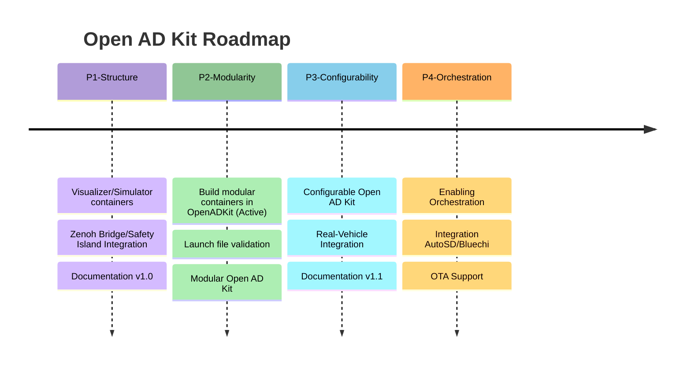

# Roadmap

```mermaid

---
config:
  logLevel: 'debug'
  theme: 'default'
  themeVariables:
    cScaleLabel0: '#000000'
    cScale0: '#b19cd9'
    cScaleLabel1: '#000000'
    cScale1: '#90c695'
    cScaleLabel2: '#000000'
    cScale2: '#87ceeb'
    cScaleLabel3: '#000000'
    cScale3: '#ffb366'
    cScaleLabel4: '#000000'
    cScale4: '#ff6666'
    cScaleLabel5: '#000000'
---

timeline
    title Open AD Kit Roadmap
    P1-Structure
      : Visualizer/Simulator containers
      : Zenoh Bridge/Safety Island Integration
      : Documentation v1.0
    P2-Modularity
      : Build modular containers in OpenADKit (Active)
      : Launch file validation
      : Modular Open AD Kit
    P3-Configurability
      : Configurable Open AD Kit
      : Real-Vehicle Integration
      : Documentation v1.1
    P4-Orchestration
      : Enabling Orchestration
      : Integration AutoSD/Bluechi
      : OTA Support
```
