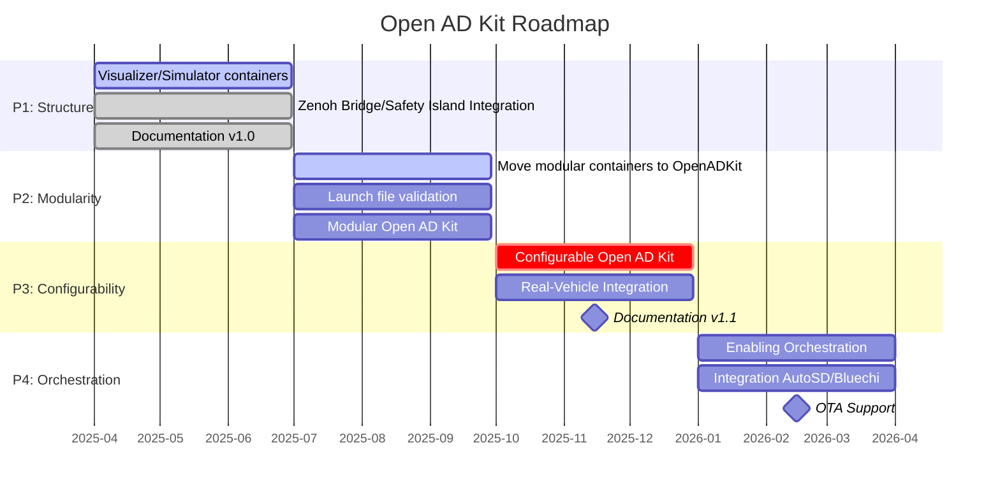

# Roadmap

```mermaid
gantt
    title Open AD Kit Roadmap
    dateFormat  YYYY-MM-DD
    axisFormat %Y-%m

    section P1: Structure
    Visualizer/Simulator containers  :active, done, 2025-04-01, 90d
    Zenoh Bridge/Safety Island Integration :done, 2025-04-01, 90d
    Documentation v1.0 :done, 2025-04-01, 90d

    section P2: Modularity
    Move modular containers to OpenADKit  :active, 2025-07-01, 90d
    Launch file validation    :2025-07-01, 90d
    Modular Open AD Kit        :2025-07-01, 90d

    section P3: Configurability
    Configurable Open AD Kit  :crit, 2025-10-01, 90d
    Real-Vehicle Integration :2025-10-01, 90d
    Documentation v1.1         :milestone, 2025-10-01, 90d

    section P4: Orchestration
    Enabling Orchestration       :2026-01-01, 90d
    Integration AutoSD/Bluechi       :2026-01-01, 90d
    OTA Support   :milestone, 2026-01-01, 90d
```
