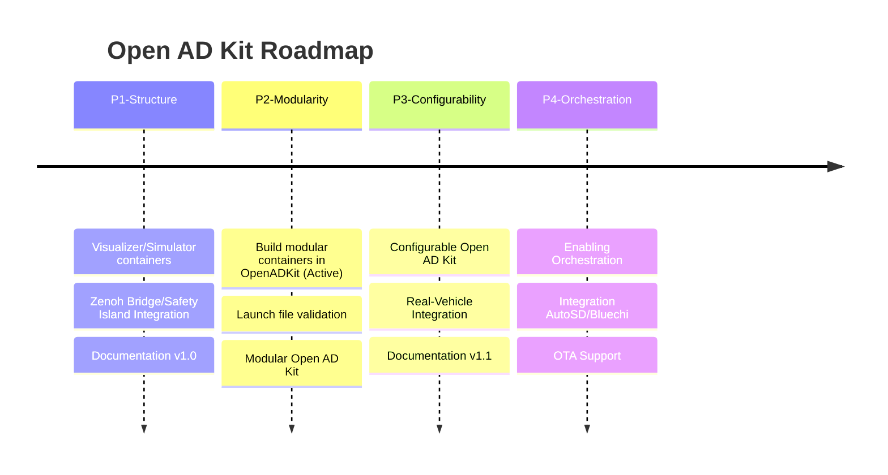

# Roadmap

```mermaid

timeline
    title Open AD Kit Roadmap
    P1-Structure
      : Visualizer/Simulator containers
      : Zenoh Bridge/Safety Island Integration
      : Documentation v1.0
    P2-Modularity
      : Build modular containers in OpenADKit (Active)
      : Launch file validation
      : Modular Open AD Kit
    P3-Configurability
      : Configurable Open AD Kit
      : Real-Vehicle Integration
      : Documentation v1.1
    P4-Orchestration
      : Enabling Orchestration
      : Integration AutoSD/Bluechi
      : OTA Support
```
