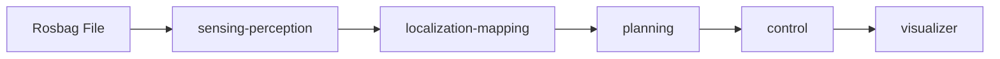

# Logging Simulation

!!! abstract ""
    The Logging Simulation deployment replays recorded sensor data (a rosbag) through the full Autoware stack. It is the most realistic single-machine simulation, testing perception, localization, and planning against actual real-world logged data.

## What You Will See

After starting the deployment and playing the rosbag, you will observe the Autoware stack processing real recorded sensor data:

- Perception outputs (detected objects, lane boundaries) overlaid on the recorded scene
- Localization estimates as the vehicle traverses the logged route
- Planning and control outputs responding to the replayed environment
- Full RViz2 visualization via the noVNC browser interface

## Prerequisites

- Docker Engine (set up via `install.sh`, below)
- NVIDIA Container Toolkit **highly recommended** (for GPU-accelerated sensing and perception)
- Logging simulation map and rosbag (downloaded below)
- Autoware artifacts (downloaded via `install.sh`)

!!! warning "GPU Strongly Recommended"
    This deployment runs the full sensing and perception pipeline. Without a GPU, performance will be significantly degraded. An NVIDIA GPU with 4 GB+ VRAM is strongly recommended.

## Before You Start

### 1. Set up the environment + download Autoware artifacts (one-time)

```bash
{{ install_command }} --download-artifacts
```

--8<-- "includes/docker-group-activation.md"

This installs Docker / the NVIDIA Container Toolkit and downloads the perception artifacts into `${HOME}/autoware_data` (mounted into the sensing and perception containers).

### 2. Choose a deployment layout

#### Source checkout setup

```bash
git clone https://github.com/autowarefoundation/openadkit.git
cd openadkit/deployments/logging-simulation
../../install.sh sample-data logging-simulation
```

#### Release bundle setup

```bash
curl -fL https://github.com/autowarefoundation/openadkit/releases/latest/download/logging-simulation.tar.gz | tar xz
cd logging-simulation
./install.sh sample-data logging-simulation
```

!!! info "About the rosbag"
    This demo rosbag (Copyright 2020 TIER IV, Inc.) is provided for demonstration. Due to privacy concerns, it does **not** contain image data. This means:

    - **Traffic light recognition** cannot be tested with this demo
    - **Object detection accuracy** is decreased compared to full camera data

## Start the Deployment

From the `logging-simulation` directory, use the command for your layout.

### Start from a source checkout

```bash
docker compose --env-file ../base/base.env --env-file logging-simulation.env up -d
```

### Start from a release bundle

```bash
docker compose --env-file logging-simulation.env up -d
```

You can start rosbag playback immediately after this command. The rosbag
container waits up to `ROSBAG_READY_TIMEOUT` seconds for a subscriber on
`ROSBAG_READY_TOPIC` before beginning the one-shot playback.

!!! tip "GPU acceleration (recommended)"
    To run sensing and perception on an NVIDIA GPU, layer the GPU compose overlay and its env file on top of the base ones (both `--env-file` flags apply, the later overriding the former):

    Source checkout:

    ```bash
    docker compose -f docker-compose.yaml -f docker-compose.gpu.yaml \
      --env-file ../base/base.env --env-file logging-simulation.env --env-file logging-simulation.gpu.env up -d
    ```

    Release bundle:

    ```bash
    docker compose -f docker-compose.yaml -f docker-compose.gpu.yaml \
      --env-file logging-simulation.env --env-file logging-simulation.gpu.env up -d
    ```

    This swaps in the `sensing-perception-cuda` image and reserves the GPU for the `sensing` and `perception` services. It requires the NVIDIA Container Toolkit (installed by `install.sh` by default). The `sensing-perception-cuda` image is published for `linux/amd64` only.

--8<-- "includes/visualizer-remote-access.md"

## Start the Rosbag Playback

To begin replaying the recorded sensor data, start the rosbag container:

### Play a rosbag from a source checkout

```bash
docker compose --env-file ../base/base.env --env-file logging-simulation.env \
  --profile rosbag up -d rosbag
```

### Play a rosbag from a release bundle

```bash
docker compose --env-file logging-simulation.env --profile rosbag up -d rosbag
```

Watch the RViz2 display as Autoware processes the replayed data in real time.

## View Logs

### View source checkout logs

```bash
# Stack logs
docker compose --env-file ../base/base.env --env-file logging-simulation.env logs -f

# Rosbag playback logs
docker compose --env-file ../base/base.env --env-file logging-simulation.env \
  --profile rosbag logs -f rosbag
```

### View release bundle logs

```bash
# Stack logs
docker compose --env-file logging-simulation.env logs -f

# Rosbag playback logs
docker compose --env-file logging-simulation.env --profile rosbag logs -f rosbag
```

## Stop the Deployment

To stop all containers including the rosbag profile:

### Stop a source checkout

```bash
docker compose --env-file ../base/base.env --env-file logging-simulation.env --profile rosbag down
```

### Stop a release bundle

```bash
docker compose --env-file logging-simulation.env --profile rosbag down
```

## Troubleshooting

| Issue | Solution |
|-------|----------|
| Containers fail to start | Verify `~/autoware_data` exists and contains the downloaded artifacts |
| `file not found` for map/rosbag | Re-download the sample data using the command below |
| No objects detected | The rosbag lacks image data. This is expected for the demo rosbag. |

```bash
# Source checkout
../../install.sh sample-data logging-simulation --force

# Release bundle
./install.sh sample-data logging-simulation --force
```

For Docker, GPU, and visualizer issues common to all deployments, see [Troubleshooting](../../getting-started/troubleshooting.md).

## Architecture



Simplified data flow above; the full stack also runs `map`, `system`, `vehicle`, `simulator`, and `api` support services.

## Known Limitations

The `rosbag` service in this deployment uses the upstream `ghcr.io/autowarefoundation/autoware:universe` image rather than an Open AD Kit component image. Release bundles pin the selected manifest digest; source checkouts retain the readable upstream tag. A component-based replacement will ship in a future release.

## Related

- [Planning Simulation](../planning-simulation/index.md) — Simpler planning-focused simulation
- [Scenario Simulation](../scenario-simulation/index.md) — Predefined scenario testing
- [Components Overview](../../components/index.md) — Learn about the sensing and perception stack
- [Getting Started](../../getting-started/index.md) — Environment setup and artifact download
