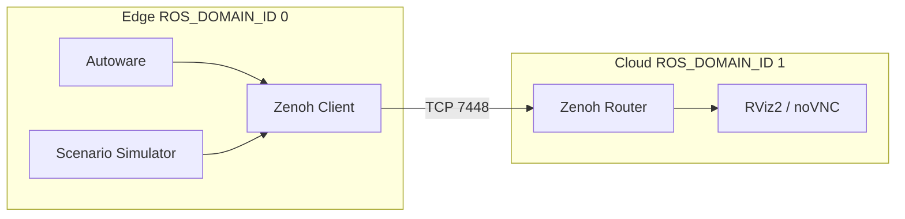

# Zenoh Bridge

Bridge an edge Autoware domain to a separate visualization and control domain.
The edge runs Autoware and simulation; the cloud side runs browser-based RViz2.
Zenoh carries selected ROS 2 topics between the isolated domains.

## Architecture



The separate ROS domain IDs prevent native DDS cross-traffic. Configure topic
filters and namespaces in `config/zenoh-bridge-ros2dds.json5`.

## Setup

```bash
{{ install_command }}
git clone https://github.com/autowarefoundation/openadkit.git
cd openadkit/deployments/zenoh-bridge
cp .env.example .env
../../install.sh sample-data zenoh-bridge
```

--8<-- "includes/docker-group-activation.md"

--8<-- "includes/first-release-note.md"

From an extracted release bundle, run `./install.sh sample-data zenoh-bridge`.

Edit `.env` before starting:

| Variable | Purpose | Default |
|----------|---------|---------|
| `MAP_PATH` | Kashiwanoha map directory | `$HOME/autoware_map/kashiwanoha_map` |
| `REMOTE_PASSWORD` | Required noVNC password | None |
| `ZENOH_ROUTER_BIND_IP` | Cloud router host interface | `127.0.0.1` |

Docker Compose reads `.env` as data; helper scripts do not execute it. Exported
shell variables override file values. For multi-host runs, set `CLOUD_IP` (and
usually `ZENOH_ROUTER_BIND_IP`) via `export` on each machine — see
[Separate Machines](#separate-machines). Single-host compose defaults
`CLOUD_IP` to the `cloud_zenoh_bridge` service name. The deployment uses wall
time and does not bridge `/clock`.

!!! warning "Zenoh transport is not secured"
    TCP 7448 has no authentication or encryption. For separate machines, use a
    VPN/private network, bind `ZENOH_ROUTER_BIND_IP` to that exact interface,
    and restrict the port to trusted peers. `REMOTE_PASSWORD` protects only
    noVNC. Wildcard router binds are rejected.

## Run

### Split Topology

Start cloud first, then edge:

```bash
./cloud.sh up -d
./edge.sh up -d
```

### Single Host

```bash
docker compose up -d
```

### Separate Machines

```bash
# Cloud machine
export ZENOH_ROUTER_BIND_IP=10.8.0.1
./cloud.sh up -d

# Edge machine
export CLOUD_IP=10.8.0.1
./edge.sh up -d
```

Allow TCP 7448 only through the VPN/private interface. Open the visualizer at
`https://localhost:6081/vnc.html` and use `REMOTE_PASSWORD`.

## Teleoperation

```bash
./cloud.sh up --with-teleop -d
./edge.sh --no-sim up -d
./run_teleop.sh
```

| Key | Action |
|-----|--------|
| `W` / `S` | Throttle / brake |
| `A` / `D` | Steer |
| `Z` | Toggle auto/local control |
| `X` / `C` / `V` | Drive / reverse / park |
| `M` | Cycle drive mode |
| `R` | Reset to the configured initial pose |
| `Space` | Emergency stop or resume |
| `Q` | Quit |

For a fresh `--no-sim` session, press `R` to initialize the pose, `Z` to enter
local control, choose a gear with `X` or `C`, select the drive mode with `M`,
then use the movement keys.

## Stop and Troubleshoot

```bash
./edge.sh down
./cloud.sh down
docker compose down
```

If a bridge is not ready, inspect
`docker compose logs cloud_zenoh_ready edge_zenoh_ready` and start cloud before
edge. Host ports **6081** (noVNC) and **7448** (cloud Zenoh router bind) must
be free; edge listens on **7447** only inside the compose network (not published
on the host). Re-fetch the map with
`../../install.sh sample-data zenoh-bridge --force` from a source checkout or
`./install.sh sample-data zenoh-bridge --force` from a release bundle.

The `autoware` service currently uses the upstream `autoware:universe` image;
release bundles pin its manifest digest.
