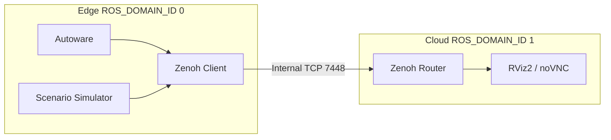

# Zenoh Bridge

Split Autoware and its visualization into separate ROS 2 domains and connect
them with Zenoh. The edge side runs Autoware and the simulator; the cloud side
runs browser-based RViz2. Both run on one host in one Compose project.



This deployment needs a source checkout. It is not part of the release bundle
and is not managed by `openadkit run`.

## Setup

From the repository root, after the [Quickstart](../../getting-started/index.md)
setup:

```bash
./openadkit fetch scenario-simulation   # the Kashiwanoha map
cd deployments/zenoh-bridge
```

Set these in the shell or in `config.env`:

| Variable | Purpose | Default |
|----------|---------|---------|
| `MAP_PATH` | Kashiwanoha map directory | `$HOME/autoware_map/kashiwanoha_map` |
| `REMOTE_PASSWORD` | noVNC password | `openadkit` |

Topic filters and namespaces are in `config/zenoh-bridge-ros2dds.json5`.

## Run

```bash
./cloud.sh up -d
./edge.sh up -d            # add --no-sim to skip the scenario simulator
```

Open the visualizer at `https://localhost:6081/vnc.html` and sign in with
`REMOTE_PASSWORD`.

The Zenoh link (TCP 7448) has no authentication or encryption, so it stays
inside the Compose network and is not published to the host. The bridge does not
forward `/clock`; both sides use wall time.

## Teleoperation

```bash
./cloud.sh up -d --with-teleop
./edge.sh up -d
./run_teleop.sh
```

Start the edge with `--no-sim` to drive Autoware without the scenario simulator.

| Key | Action |
|-----|--------|
| `W` / `S` | Throttle / brake |
| `A` / `D` | Steer |
| `Z` | Toggle between `STOP` and the configured `operator_mode` (`REMOTE` by default) |
| `X` / `C` / `V` | Drive / reverse / park |
| `M` | Cycle drive mode |
| `R` | Cycle the initial-pose presets and set the pose |
| `Space` | Emergency stop or resume |
| `Q` | Quit |

In a `--no-sim` session: press `R` to set a pose, `Z` to leave `STOP`, choose a gear
with `X` or `C`, select a drive mode with `M`, then steer and accelerate.

## Stop and Troubleshoot

```bash
./edge.sh logs
./cloud.sh logs
./edge.sh down
./cloud.sh down
```

Host port 6081 must be free. If the map is missing, run
`./openadkit fetch scenario-simulation --force` from the repository root.
