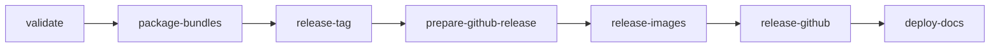

# Build from Source

How to build the Open AD Kit images locally, how CI builds them, and how
releases are cut. Most users do not need this; pull the published images
instead (see [Container Images & Versioning](../getting-started/container-images.md)).

## Prerequisites

- Ubuntu 22.04 or 24.04 (`openadkit setup` supports Ubuntu only; elsewhere,
  install Docker with Buildx and Compose yourself)
- Git, `pipx`, and `vcs2l` to import the Autoware sources
- Disk space for several multi-gigabyte images

The component Dockerfiles build on upstream Autoware images from GHCR and
compile their package sets from a local `autoware/src` tree (step 4 below).

## Build System

Images are built with [Docker Bake](https://docs.docker.com/build/bake/) from
[`components/docker-bake.hcl`](https://github.com/autowarefoundation/openadkit/blob/main/components/docker-bake.hcl),
the same file CI uses.

--8<-- "includes/build-pipeline.md"

`universe-common` compiles the shared part of Autoware Universe on the upstream
`core-devel` image and copies the result onto the lean upstream `base` image, so
build tools never reach the runtime layers. Every component builds from it.
`sensing-perception-cuda` builds on the upstream CUDA images and adds the
`universe-common` install tree.

| Group | Targets | Published to |
|-------|---------|--------------|
| `universe-common` | `universe-common-devel`, `universe-common` | `ghcr.io/autowarefoundation/openadkit-common` |
| `component` | all component images, including the amd64-only `sensing-perception-cuda` and `carla-interface` | `ghcr.io/autowarefoundation/openadkit` |
| `planning` | `universe-common` plus the images Planning Simulation needs | — (local builds) |
| `default` | `universe-common` + `component` | — |

## Build and Run Locally

```bash
# 1. Clone the repository
git clone https://github.com/autowarefoundation/openadkit.git
cd openadkit

# 2. Install host dependencies
./openadkit setup --verify
```

--8<-- "includes/docker-group-activation.md"

```bash
# 3. Make the pipx-installed vcs command available in this shell
export PATH="$HOME/.local/bin:$PATH"

# 4. Import Autoware sources at the release used by the upstream base images
AUTOWARE_REF=1.8.0
export UPSTREAM_TAG="$AUTOWARE_REF"
git clone --branch "$AUTOWARE_REF" --depth 1 \
  https://github.com/autowarefoundation/autoware.git
mkdir -p autoware/src
vcs import --shallow autoware/src < autoware/repositories/autoware.repos
mkdir -p autoware/src/middleware/external
touch autoware/src/middleware/external/.keep

# 5. Build the shared universe-common layer (~2 hours)
docker buildx bake -f components/docker-bake.hcl universe-common

# 6. Build the Planning Simulation images (~2 hours)
docker buildx bake -f components/docker-bake.hcl --load planning

# 7. Run with the local images
./openadkit run planning-simulation
```

- `--load` puts the images in the local Docker store; without it, Bake only
  fills the build cache.
- Local builds are tagged `<target>-<arch>-<ros-distro>` (for example
  `planning-control-amd64-humble`), which is the tag `./openadkit` looks up in a
  source checkout. The arch follows the build host; when cross-building, set tags
  with `--set <target>.tags=...`. To use other images, set the `*_IMAGE`
  variables in `config.local.env`.
- For Jazzy, build with `ROS_DISTRO=jazzy` and run with `--ros-distro jazzy`.

Other useful targets:

```bash
docker buildx bake -f components/docker-bake.hcl                                # everything
docker buildx bake -f components/docker-bake.hcl component                      # all components
docker buildx bake -f components/docker-bake.hcl --load sensing-perception      # one image
```

### Build Variables

| Variable | Description | Default |
|----------|-------------|---------|
| `ROS_DISTRO` | `humble` or `jazzy` | `humble` |
| `UPSTREAM_TAG` | Upstream Autoware release to build on (e.g. `1.8.0`). Empty uses the moving `<name>-<distro>` tag, which is not reproducible. | `""` |
| `UPSTREAM_REPO` | Upstream Autoware image repository | `ghcr.io/autowarefoundation/autoware` |

## Continuous Integration

[`build-all-images.yaml`](https://github.com/autowarefoundation/openadkit/blob/main/.github/workflows/build-all-images.yaml)
builds every target with the same Bake file. The build matrix comes from
[`.github/image-inventory.json`](https://github.com/autowarefoundation/openadkit/blob/main/.github/image-inventory.json),
the source of truth for which images are built and for which architectures.

Jobs run in dependency order: `prepare`, then `build-common`, then
`build-components`, then `build-carla-interface`. Most images build for Humble and
Jazzy on amd64 and arm64. `create-manifests` then combines the per-arch images
into multi-arch tags. CI disables the local tags (`LOCAL_IMAGE=""`) and tags
images through `docker/metadata-action`. A failed scheduled build opens a GitHub
issue.

## Release Process

Releases promote an existing CI build; nothing is rebuilt.

### Before You Release

- **`vars.UPSTREAM_TAG`** is set in the repository or organization variables. It
  selects the Autoware release to build; the workflow's `autoware_ref` input
  overrides it.
- **GHCR packages** accept pushes from CI: `openadkit`, `openadkit-common`, and
  `openadkit-buildcache` under `ghcr.io/autowarefoundation/`.
- **`secrets.RELEASE_TOKEN`** (Contents and Workflows write) is set when promoting
  a build commit older than later workflow changes; otherwise `GITHUB_TOKEN` is
  used.
- **A successful build** of `build-all-images` exists on `main` from an exact
  Autoware release tag. Builds from a full SHA can only become pre-releases. The
  build summary shows its `build_tag`.
- **A passing scan** of `scan-images` exists for that `build_tag`.

### Workflow

Run [`release.yaml`](https://github.com/autowarefoundation/openadkit/blob/main/.github/workflows/release.yaml)
with the version and `build_tag`. Its jobs run in order:



1. **validate**: runs the release gates in
   [`validate_release.sh`](https://github.com/autowarefoundation/openadkit/blob/main/.github/scripts/validate_release.sh)
   (version format, build provenance and age, scan results, metadata and file
   integrity, image coverage, registry digests, Git tag). Nothing is tagged if a
   gate fails.
2. **package-bundles**: writes the immutable release plan and the runtime bundle
   for both distros.
3. **release-tag**: creates or verifies the Git tag.
4. **prepare-github-release**: creates a draft release with notes and assets.
5. **release-images**: creates the release tags and, for stable releases, the
   moving aliases (see [Tag Reference](../getting-started/container-images.md#tag-reference)).
6. **release-github**: publishes the draft.
7. **deploy-docs**: republishes the docs when the stable aliases moved.

The release plan (`release-plan.json`) attached to each GitHub Release records
the exact image digests, aliases, assets, and checksums of that release.
