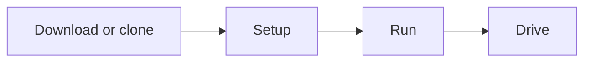

# Quickstart

From zero to a running Autoware planning simulation in about 10 minutes. No GPU or source checkout is required.



## Prerequisites

- **Ubuntu 22.04 (Jammy) or 24.04 (Noble)** with `sudo` access
- A web browser - the visualizer runs in it, no display server needed

## 1. Get Open AD Kit

=== "Release bundle"

    Resolve the latest version, download the runtime bundle and metadata, then
    verify its checksum:

    ```bash
    VERSION=$(curl -fsSL \
      https://api.github.com/repos/autowarefoundation/openadkit/releases/latest \
      | python3 -c 'import json,sys; print(json.load(sys.stdin)["tag_name"])')
    curl -fLO "https://github.com/autowarefoundation/openadkit/releases/download/${VERSION}/openadkit-${VERSION}.tar.gz"
    curl -fLO "https://github.com/autowarefoundation/openadkit/releases/download/${VERSION}/release-metadata.json"
    EXPECTED=$(python3 -c 'import json; print(json.load(open("release-metadata.json"))["bundles"][0]["sha256"])')
    printf '%s  %s\n' "$EXPECTED" "openadkit-${VERSION}.tar.gz" | sha256sum --check -
    tar -xzf "openadkit-${VERSION}.tar.gz"
    cd "openadkit-${VERSION}"
    ```

=== "Source checkout"

    ```bash
    git clone https://github.com/autowarefoundation/openadkit.git
    cd openadkit
    ```

The release bundle contains only the runtime entry point and deployment assets.
A source checkout also contains `components/`, CI, tests, and development tools.

## 2. Set Up the Host

```bash
./openadkit setup --verify
```

Run setup as your normal user. It requests `sudo` only for host changes. CPU is
the default; add `--gpu` for NVIDIA deployments or `--development` in a source
checkout that will build images locally. `--gpu` also installs NVIDIA
OpenGL/Vulkan libraries needed for CARLA.

--8<-- "includes/docker-group-activation.md"

## 3. Run Planning Simulation

```bash
./openadkit run planning-simulation
```

Add `--ros-distro jazzy` to select Jazzy. Humble is the default in both source
checkouts and release bundles.

`run` downloads and verifies the sample map, pulls missing images, waits for
Compose readiness, and verifies the running deployment. A verification failure
leaves the containers running so their logs remain available.

## 4. Open the Visualizer

Wait about 10 seconds for the containers to initialize, then open:

```text
https://localhost:6080/vnc.html
```

Use the default password **`openadkit`** and accept the self-signed certificate.

For a remote host, keep noVNC loopback-only and forward it over SSH:

```bash
ssh -L 8080:localhost:6080 <user>@<host>
```

Then open `https://localhost:8080/vnc.html` locally.

## 5. Drive

In RViz2, follow the [Autoware planning simulation instructions](https://autowarefoundation.github.io/autoware-documentation/main/demos/planning-sim/lane-driving/#2-set-an-initial-pose-for-the-ego-vehicle) to:

1. Set an **initial pose** for the ego vehicle
2. Set a **goal pose** on the map
3. Watch the vehicle plan and drive the route

## Runtime Controls

```bash
./openadkit status planning-simulation
./openadkit logs planning-simulation --follow
./openadkit stop planning-simulation
./openadkit down planning-simulation
```

Use `deployments/<name>/config.local.env` for host-specific settings. Source
checkouts also accept component image overrides there; release component refs
remain pinned by the release context. The file is ignored by Git.

For source builds and local image development, use the separate
[Build from Source](../development/build-from-source.md) workflow.

If something goes wrong, see [Troubleshooting](troubleshooting.md).

## Next Steps

**[Explore the other deployments](../deployment/index.md)** - curated scenario
testing and rosbag replay, plus standalone source-checkout workflows for CARLA
and distributed cloud-edge operation with Zenoh.

- [Components](../components/index.md) - The architecture behind what you just ran
- [Container Images & Versioning](container-images.md) - Tag schema and pinning guidance
- [Custom Deployment](../deployment/custom-deployment.md) - Compose your own stack
