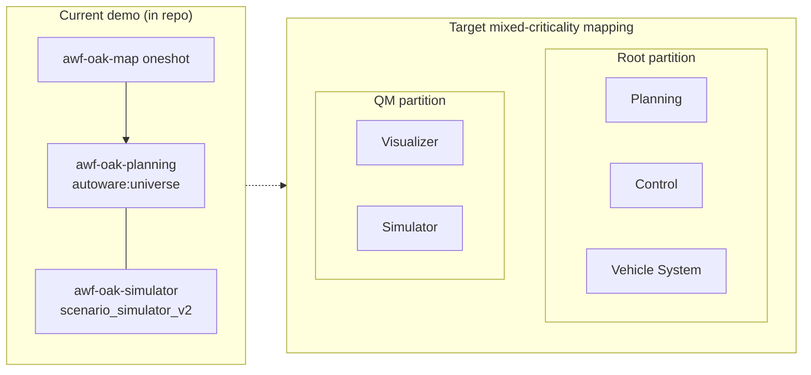

# AutoSD + Open AD Kit

!!! abstract ""
    AutoSD is the upstream binary distribution serving as the public, in-development preview of the **Red Hat In-Vehicle Operating System (RHIVOS)**. It brings cloud-native, container-first principles to automotive edge computing with an emphasis on safety, security, and deterministic behavior.

## What is AutoSD?

AutoSD is built on **CentOS Stream** with an automotive-specific kernel
(`kernel-automotive`). It is the upstream, in-development preview of Red Hat's
commercial **In-Vehicle OS (RHIVOS)**, which Red Hat positions for
functional-safety use. In this repository, it is the platform-specific deployment
path for Open AD Kit.

## Key Features for Autonomous Driving

<div class="oak-card-grid" markdown="1">

<div class="oak-card" markdown="1">

:material-shield-check:{ .oak-card-icon }

<p class="oak-card-title" role="heading" aria-level="3">Mixed Criticality</p>
<p>Separates safety-critical containers in the root partition from non-critical workloads in the QM partition using systemd, Eclipse BlueChi, and QM.</p>
</div>

<div class="oak-card" markdown="1">

:material-refresh-auto:{ .oak-card-icon }

<p class="oak-card-title" role="heading" aria-level="3">Atomic Updates</p>
<p>Immutable system images with OSTree and composefs enable A/B updates, rollback, and tamper-proofing. Bootc brings container-native OS lifecycle management.</p>
</div>

<div class="oak-card" markdown="1">

:material-clock-fast:{ .oak-card-icon }

<p class="oak-card-title" role="heading" aria-level="3">Real-Time Kernel</p>
<p>RT-optimized automotive kernel with deterministic scheduling for time-critical autonomous driving functions.</p>
</div>

<div class="oak-card" markdown="1">

:material-docker:{ .oak-card-icon }

<p class="oak-card-title" role="heading" aria-level="3">Container-Native</p>
<p>Built around Podman, Quadlet (systemd container units), and BlueChi orchestration. No Docker daemon required.</p>
</div>

</div>

## Repository layout

Runnable AutoSD assets live under
[`platforms/autosd/`](https://github.com/autowarefoundation/openadkit/tree/main/platforms/autosd)
in the Open AD Kit repository. Each use-case directory contains at least:

- **Quadlet files** to define containerized services managed by Podman and systemd
- **Automotive Image Builder files** to build an AutoSD image

Build and run commands on this page assume you are inside a use-case directory
such as `platforms/autosd/planning-simulator/`.

- [Planning Simulator](planning-simulator/index.md): Platform demo that runs
  Autoware planning and TIER IV Scenario Simulator under Podman/Quadlet
- [R-Car X5H](https://github.com/autowarefoundation/openadkit/tree/main/platforms/autosd/x5h):
  AutoSD 10 rootfs for the R-Car X5H board, netbooted under the BSP or a rebuilt
  AutoSD-aligned kernel and QEMU-gated before board bring-up

## Requirements

| Path | Needs |
|------|-------|
| Container script (recommended) | Docker or Podman, QEMU |
| Automotive Image Builder on the host | RPM-based Linux (Fedora, CentOS, or RHEL), Automotive Image Builder, OSBuild, QEMU |

## Building an AutoSD Image

This section guides you through running `automotive-image-builder` from a
container. From a clone of this repository, `cd` into a use-case directory
(for example `platforms/autosd/planning-simulator/`) before running the
commands below.

First, download the runner script and build the builder container:

```bash
curl -fL -o auto-image-builder.sh \
  "https://gitlab.com/CentOS/automotive/src/automotive-image-builder/-/raw/main/auto-image-builder.sh?ref_type=heads"
chmod +x auto-image-builder.sh
sudo bash ./auto-image-builder.sh build-builder --distro autosd10-sig
```

Now build the image (requires sudo/root). The container image is the first
positional argument and the bootable disk image the second:

```bash
sudo bash ./auto-image-builder.sh build \
  --distro autosd10-sig \
  --target qemu \
  --define-file aib/vars.yml \
  aib/image.aib.yml \
  localhost/awf-oak:latest \
  disk.qcow2
```

You may want to change the owner of `disk.qcow2`:

```bash
sudo chown $(logname) disk.qcow2
```

You can now use QEMU to run the image from a mounted QEMU disk.

## Running the Image

If you have `air` available:

```bash
air disk.qcow2
```

Otherwise, use the following example QEMU command:

```bash
/usr/bin/qemu-system-x86_64 \
  -drive file=/usr/share/OVMF/OVMF_CODE.fd,if=pflash,format=raw,unit=0,readonly=on \
  -drive file=/usr/share/OVMF/OVMF_VARS.fd,if=pflash,format=raw,unit=1,snapshot=on,readonly=off \
  -smp 20 \
  -nographic \
  -enable-kvm \
  -m 2G \
  -machine q35 \
  -cpu host \
  -device virtio-net-pci,netdev=n0,mac=FE:00:e2:0d:ba:4d \
  -netdev user,id=n0,net=10.0.2.0/24,hostfwd=tcp::2222-:22 \
  -drive file=disk.qcow2,index=0,media=disk,format=qcow2,if=virtio,id=rootdisk,snapshot=off
```

!!! note "Memory sizing"
    `-m 2G` only boots and explores the AutoSD image. The full Open AD Kit stack
    needs much more — see the [hardware requirements](../hardware/index.md)
    (16 GB minimum, 32 GB recommended) — so raise `-m` accordingly: start at
    `-m 16384`, or `-m 32768` for heavier workloads.

## Current demo vs target architecture

!!! note "Platform demo, not modular Open AD Kit images"
    The in-repo [Planning Simulator](planning-simulator/index.md) path is a
    **platform demo**. It does **not** run the modular
    `ghcr.io/autowarefoundation/openadkit:*` component images used by Docker
    Compose deployments. Automotive Image Builder pins two upstream images:

    - `ghcr.io/autowarefoundation/autoware:universe-0.45.1-amd64` → `localhost/autoware:latest`
    - `ghcr.io/tier4/scenario_simulator_v2:humble-25.0.20-runtime` → `localhost/scenario_simulator_v2:runtime`

    After boot, systemd runs two containers in one pod (`awf-oak-planning` and
    `awf-oak-simulator`) plus a map extraction oneshot. That is not the full
    map/planning/control/vehicle/api/visualizer split, and not BlueChi
    multi-host orchestration.

AutoSD's mixed-criticality features remain a natural **target** home for Open AD
Kit's component model on production profiles (see
[Releases & Roadmap](../../releases/index.md)):

<div class="oak-component-grid oak-component-grid--four">

<div class="oak-component-item">
<strong>Root Partition</strong>
<span>Higher-criticality workloads (planning, control, vehicle interface) can map to the privileged root partition with RT scheduling.</span>
</div>

<div class="oak-component-item">
<strong>QM Partition</strong>
<span>Non-critical workloads (visualizer, simulator, development tools) can be isolated in the QM partition for safety containment.</span>
</div>

<div class="oak-component-item">
<strong>OSTree / Bootc</strong>
<span>Atomic, rollback-capable updates. The entire OS is versioned and updated as a unit, matching Open AD Kit's container-native philosophy.</span>
</div>

<div class="oak-component-item">
<strong>BlueChi + Quadlet</strong>
<span>Container orchestration via systemd units. Production profiles may map each Open AD Kit component to a Quadlet service; BlueChi is available for multi-host orchestration.</span>
</div>

</div>


